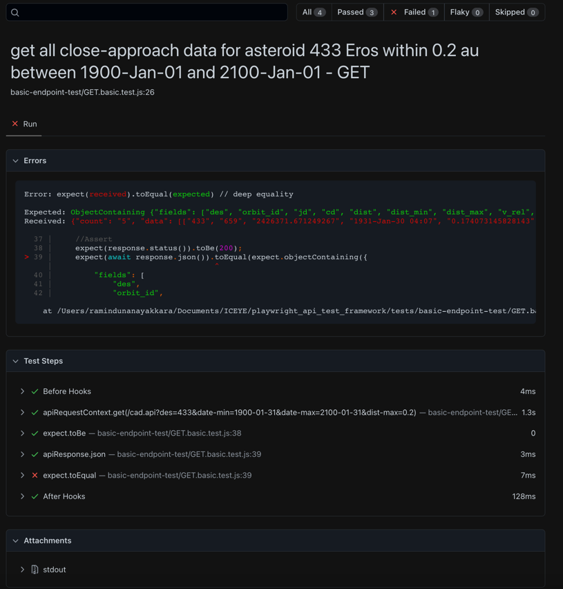

# Playwright Api Test Framework

## Technologies
* javascript
* Playwright
* Winston
* Docker

## Run Docker image

Build the image.
* docker build -t playwright-framework .

Create container name 'playwright-framework-container' and run the test.
* docker run -it --rm -p 9323:9323 --name playwright-framework-container playwright-framework

Can stop the docker contain.
* docker stop playwright-framework-container 

## Report

1. Report can be access from - http://127.0.0.1:9323  while the docker container is running in the background

2. After the test is completed and while the container is running, perform the below command to copy the report directory to the local directory to access the report locally.
* docker cp playwright-framework-container:/playwright_api_test_framework/playwright-report playwright-report-from-docker

Overview

Sample Pass test

Sample Fail test

Sample log file

